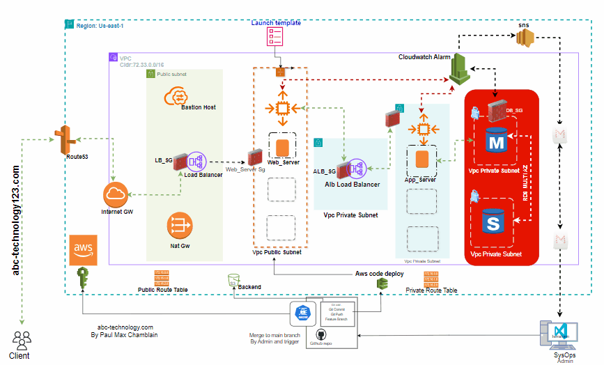

# Welcome to abc-technology123 Website Cloud-Project

## 🌐 Project Overview
abc-technology123 Website is a highly available, scalable web application deployed on the cloud. The infrastructure is defined using **Terraform** (Infrastructure as Code - IaC) and the application is continuously built and deployed through a **GitHub Actions** CI/CD pipeline 

### **Author**
- Paul Max Chamblain | 

[Linkedin] (https://www.linkedin.com/in/paulmchamblain/)

### Below is an image showcasing the architecture of the cloud-based application I built.

### Key Features & Architecture:
The application follows a 3-tier architecture:
- Frontend (Web Tier):

Load Balancer: The Application Load Balancer (ALB) is used to distribute incoming HTTP traffic (port 80) to the web servers.
Web Servers: These are EC2 instances running behind the ALB in an Auto Scaling Group (ASG) to automatically scale based on traffic demand.

- Backend (App Tier):

 The web servers communicate with application servers over port 8080. This communication is managed by security groups, ensuring that traffic is routed securely.
 
 
- Database (DB Tier):

RDS (Relational Database Service) is used to host the MySQL database, with strict network controls to only   allow communication from the application tier on port 3306.

### Security Groups:
- Frontend Security Group (ALB-SG): Allows incoming traffic from the public (port 80).

- Web Server Security Group (Web-SG): Allows incoming traffic only from the ALB and allows outgoing traffic to the application servers on port 8080.

- App Server Security Group (App-SG): Allows incoming traffic from the web servers (port 8080) and allows    outgoing traffic to the database (port 3306).

- Database Security Group (DB-SG): Allows incoming traffic from the application tier on port 3306 only.

### Infrastructure as Code (IaC) with Terraform:
  - Used Terraform to provision and manage the infrastructure, making the deployment repeatable, consistent, and easily versioned.
  - Terraform configurations are written to automate the provisioning of cloud resources (e.g., compute   instances, networking, storage).

### CI/CD with GitHub Actions:

- Implemented a GitHub Actions CI/CD pipeline to automate testing, building, and deploying the Sigma-Tech Website.

- The pipeline includes steps for:
     -Build: Building the project and ensuring code quality.
     -Test: Running unit and integration tests.
     -Deploy: Deploying the website to the cloud

### Workflow Overview

- Code Commit:
   When a developer pushes code changes to the repository, the GitHub Actions pipeline is triggered.

- Build:
    The pipeline installs dependencies and prepares the application for deployment.
    In the case of a web application, this could involve steps such as installing NPM packages (for Node.js applications) or compiling assets.

- Test:
The pipeline runs unit tests, integration tests, or any other custom tests to ensure the application is functioning correctly.

- Terraform Apply:
The infrastructure is defined using Terraform. The pipeline checks for changes in the infrastructure configuration and automatically runs terraform apply to provision or update the infrastructure.

- Load Balancing & Auto Scaling: Leveraged Elastic Load Balancer (ELB) and Auto Scaling for both the Web-tier and App-tier, ensuring high availability and seamless scalability during traffic spikes.

- Security & Isolation: Utilized Security Groups and isolated Subnets to secure infrastructure, ensuring proper traffic flow control and isolation between layers.

- Cost Optimization: Achieved significant cost reductions and simplified configuration management by integrating S3 Gateway Endpoint and EC2 Instance Connect Endpoint, minimizing the need for public IPs and enhancing security.

- Disaster Recovery & Failover Testing: Performed manual failover of RDS Multi-AZ database using the AWS Management Console to validate high availability and disaster recovery capabilities.

- Monitoring & Performance: Monitored and ensured optimal performance by setting up CloudWatch Alarms to track the health of both Web-tier and App-tier instances, proactively addressing resource utilization and performance bottlenecks.

